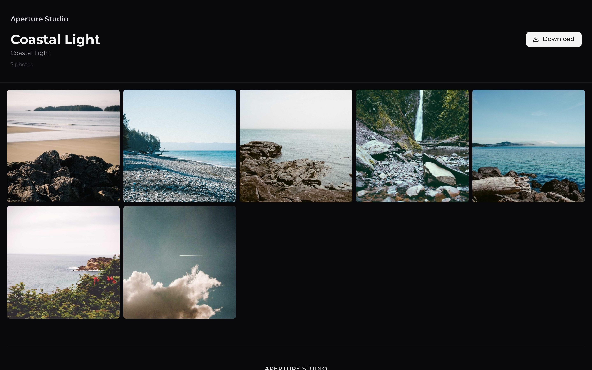

<p align="center">
  
</p>

<h1 align="center">ContactSheet</h1>

<p align="center">
  Self-hosted photo delivery for photographers — share a shoot with your client
  via a clean, password-optional link, and let them browse, review, and choose.
</p>

<p align="center">
  
  
  
  
</p>

<p align="center">
  <a href="https://github.com/nielsfranke/contactsheet/wiki"><b>User guide</b></a> ·
  <a href="https://github.com/nielsfranke/contactsheet/wiki/Self-Hosting-and-Deployment">Self-hosting</a> ·
  <a href="https://github.com/nielsfranke/contactsheet/blob/main/ARCHITECTURE.md">Architecture</a> ·
  <a href="https://github.com/nielsfranke/contactsheet/blob/main/TRANSLATING.md">Translating</a> ·
  <a href="https://github.com/nielsfranke/contactsheet/blob/main/LICENSE">License</a>
</p>

---

The name nods to the photographer's **contact sheet** — the single page of thumbnail frames,
contact-printed straight from a roll of negatives, used to review a shoot and pick the keepers.
ContactSheet is the digital version.

<p align="center">
  <a href="https://github.com/nielsfranke/contactsheet/wiki/Screenshots">
    
  </a>
</p>
<p align="center"><sub>A client gallery in Showcase mode · <a href="https://github.com/nielsfranke/contactsheet/wiki/Screenshots">more screenshots →</a> · placeholder photos via <a href="https://picsum.photos/">Lorem Picsum</a> (Unsplash; see <a href="demo/assets/CREDITS.md">credits</a>)</sub></p>

## About

I built ContactSheet for myself — a self-hosted way to deliver a shoot to clients and let them browse,
review, and choose. There's plenty of paid SaaS but little you can run yourself
([PICR](https://github.com/IsaacInsoll/PICR) is one I took inspiration from), so I made my own. I'm not
a professional developer and much of it was built with AI assistance ([Claude Code](https://claude.com/claude-code))
under my direction, so expect the odd rough edge — [bug reports](https://github.com/nielsfranke/contactsheet/issues)
are very welcome.

## Highlights

- **Two gallery modes** — *Showcase* (a polished, view-only gallery) or *Review* (clients flag, like, comment).
- **Client feedback** — color flags, per-person likes, comments, and **freehand annotations** drawn right on a photo.
- **Collections** — multi-select photos into named, downloadable sets; admin *and* clients can build them.
- **Client uploads** — optionally let visitors contribute photos, with an optional **approval queue**.
- **Nested galleries** — organize shoots to any depth, with drag-and-drop reparenting and photo moves.
- **Sharing controls** — friendly URL slugs, optional per-gallery passwords, and expiry dates.
- **Downloads** — original-file download and gallery **ZIP** export (with a sub-gallery picker).
- **Watermarks** — image or text overlays composited onto delivered photos.
- **Live updates** — comments, flags, likes, and new uploads appear in every open viewer in real time.
- **Notifications** — email, Pushover, ntfy, Discord, Telegram, Slack, or any [Apprise](https://github.com/caronc/apprise) URL.
- **Video** — browser-playable MP4/MOV/WebM, streamed with seek support (no transcoding).
- **Branding & PWA** — your logo, accent color, and a public footer; installable with a branding-aware app icon.
- **Multilingual** — English & German out of the box, community-translatable via [Weblate](https://translate.nielsbox.cc).
- **Mobile-first** — galleries and the admin dashboard reflow to a single column with a native swipe lightbox.

See the **[User guide](https://github.com/nielsfranke/contactsheet/wiki)** for the full tour.

## Quick start

```bash
git clone https://github.com/nielsfranke/contactsheet.git
cd contactsheet
cp .env.example .env
docker compose up -d
```

That's the whole stack — one command brings up three small services (`nginx` → `frontend` + `backend`).
No database server to run: SQLite lives in a volume and migrations apply automatically on start.

Open **http://localhost:8765** and the **first-run setup wizard** walks you through creating your admin
account in the browser — no secrets needed in `.env`.

> Prefer pre-built images? `docker compose pull && docker compose up -d` (multi-arch amd64/arm64).

Environment variables, the two-volume layout, reverse-proxy/HTTPS, updating, and backups are all in
**[Self-Hosting and Deployment](https://github.com/nielsfranke/contactsheet/wiki/Self-Hosting-and-Deployment)**.

## Documentation

| | |
|---|---|
| 📖 **[User guide](https://github.com/nielsfranke/contactsheet/wiki)** | Galleries, sharing, client review, branding, settings |
| 🚀 **[Self-hosting](https://github.com/nielsfranke/contactsheet/wiki/Self-Hosting-and-Deployment)** | Docker Compose, env vars, reverse proxy, backups |
| 🛠️ **[Development](https://github.com/nielsfranke/contactsheet/wiki/Development)** | Run the backend & frontend locally |
| 🏗️ **[Architecture](ARCHITECTURE.md)** | Full technical design |
| 🌍 **[Translating](TRANSLATING.md)** | Help translate the app (no code required) |

## License

[GNU AGPL-3.0-or-later](LICENSE). ContactSheet is free software — use, modify, and self-host it freely.
If you distribute a modified version **or run it as a network service**, you must release your changes
under the same license and make the corresponding source available to your users.

Contributions are welcome under a simple [Contributor License Agreement](CLA.md).
